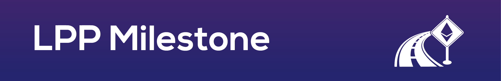

> Ethereum contract for liquid pledging milestone plugin

Welcome to the code for the milestone plugin for [liquid pledging](https://github.com/Giveth/lpp-milestone). This contract sets the rules for milestones on the Giveth [dapp](https://github.com/Giveth/giveth-dapp).

## Table of content

- [Getting Started](#getting-started)
    - [Install](#install)
    - [Requirements](#requirements)
    - [Package](#package)
- [Run demo](#run-demo)
- [Help](#help)

### Install
1. Click **Star** on this repo near the top-right corner of this web page (if you want to).
2. Join our [slack](http://slack.giveth.io) if you haven't already.
3. Fork this repo by clicking **Fork** button in top-right corner of this web page. Continue to follow instruction steps from your own lpp-milestone repo.
5. The rest of these steps must be done from your machine's command line. Clone your own "lpp-milestone" repo: 
    ```
    git clone https://github.com/GITHUB_USERNAME/lpp-milestone.git
    ```
6. Change directories to lpp-milestone:
    ```
    cd lpp-milestone
    ```

### Requirements
Make sure you have [NodeJS](https://nodejs.org/) (v8.4.0 or higher) and [npm](https://www.npmjs.com/) (5.4.1 or higher) installed.

### Package
The lpp-milestone contract is published as an npm package for developer convenience. To include it as a dependency in your package.json run this from your apps root dirctory.
```
 npm install lpp-milestone --save
```

## Run demo
This plugin is currently being used by the Giveth [dapp](https://github.com/Giveth/giveth-dapp). Follow the instructions on the readme.

## Help
Reach out to us on [slack](http://slack.giveth.io) for any help or to share ideas.
